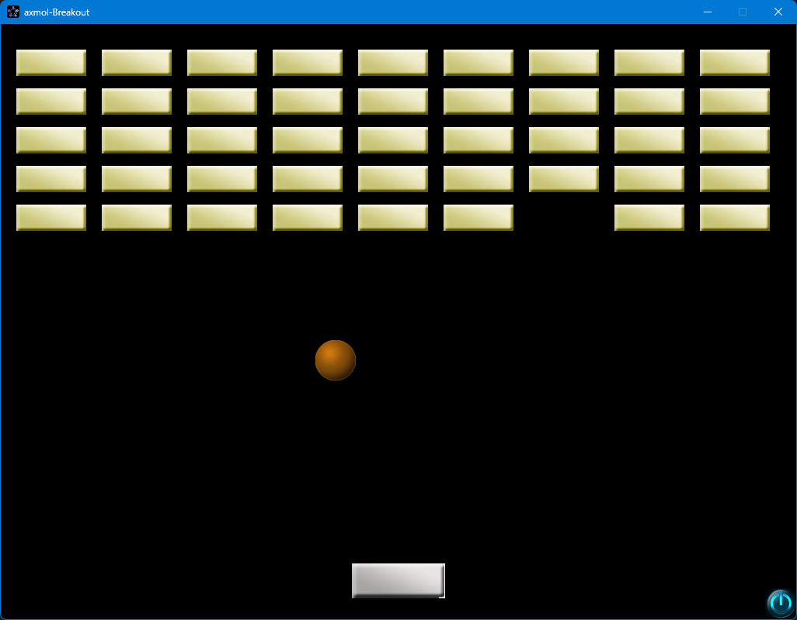

Original source from: https://github.com/HTC77/cocos2d-x-Breakout

Documentations and samples (cocos2d-x)
-------------
* [All Docs in a single place!](http://cocos2d-x.org/docs/)
* [Online API Reference](http://cocos2d-x.org/docs/api-ref/index.html) _Note that Cocos2d-x, Cocos2d-JS and Cocos Creator have different API set_
* [Programmers Guide](http://cocos2d-x.org/docs/programmers-guide/2/index.html)
* [Latest Release Note](https://github.com/cocos2d/cocos2d-x/blob/v3/docs/RELEASE_NOTES.md)
* [Changelog](https://github.com/cocos2d/cocos2d-x/blob/v3/CHANGELOG)

Learning Resources (cocos2d-x)
--------------------------------

* [Programmers Guide](http://cocos2d-x.org/docs/programmers-guide/2/index.html)
* [Sonar Systems Videos](https://www.youtube.com/user/sonarsystemslimited/search?query=cocos2d-x)
* [Android Fundamentals](https://developer.android.com/guide/components/fundamentals.html)
* [Make School Tutorials](https://www.makeschool.com/tutorials/)
* [Games From Scratch](http://www.gamefromscratch.com/page/Cocos2d-x-CPP-Game-Programming-Tutorial-Series.aspx)
* [Cocos2d sample games](https://github.com/cocos2d/cocos2d-x-samples)
